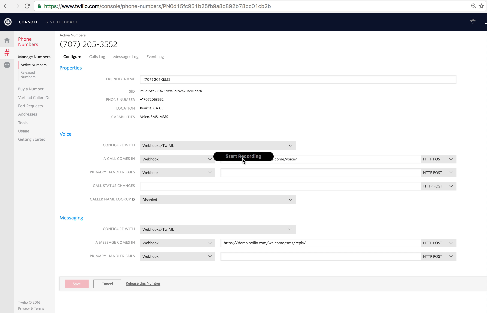

<a href="https://www.twilio.com">
  
</a>

[](https://travis-ci.org/TwilioDevEd/survey-node)

# Automated Surveys. Powered by Twilio - Node.js/Express

Instantly collect structured data from your users with a survey conducted over a voice call or SMS text messages. Learn how to create your own survey in the language and framework of your choice. For a step-by-step tutorial see [twilio docs](https://www.twilio.com/docs/howto/walkthrough/automated-survey/node/express).

## Deploy On Heroku

[](https://heroku.com/deploy?template=https://github.com/TwilioDevEd/survey-node)

  And, remember to configure Twilio webhooks in the configuration section below.

## Local development

First you need to install [Node.js](http://nodejs.org/).

1. This sample application stores data in a [MongoDB](https://www.mongodb.org/) database using [Mongoose](http://mongoosejs.com/). You can   download and run MongoDB yourself (on OS X, Linux or Windows).

   On OS X, maybe the easiest way to get MongoDB running locally is to install it via [Homebrew](http://brew.sh/).

   ```bash
   $ brew install mongodb
   ```
   You should then be able to run a local server with:

   ```bash
   $ mongod
   ```

To run the app locally:

1. Clone this repository and `cd` into it

   ```bash
   $ git clone git@github.com:TwilioDevEd/survey-node.git

   $ cd survey-node
   ```

1. Install dependencies

    ```bash
    $ npm install
    ```

1. Copy the sample configuration file and edit it to match your configuration

   ```bash
   $ cp .env .env.local
   ```
   Be sure to set `MONGO_URL`to your local mongo instance uri for example:
   `mongodb://localhost:27017/surveys` where `surveys` is the db name.

   Run `source .env.local` to export the environment variables

1. Run the application

    ```bash
    $ npm start
    ```
    Alternatively you might also consider using [nodemon](https://github.com/remy/nodemon) for this. It works just like
    the node command but automatically restarts your application when you change any source code files.

    ```bash
    $ npm install -g nodemon
    $ nodemon index
    ```
1. Expose your application to the wider internet using [ngrok](http://ngrok.com). This step
   is important because the application won't work as expected if you run it through
   localhost.

   ```bash
   $ npm i -g ngrok
   $ ngrok http 3000
   ```

   Once ngrok is running, open up your browser and go to your ngrok URL. It will
   look something like this: `http://9a159ccf.ngrok.io`

   You can read [this blog post](https://www.twilio.com/blog/2015/09/6-awesome-reasons-to-use-ngrok-when-testing-webhooks.html)
   for more details on how to use ngrok.

   ### Configure Twilio to call your webhooks

   You will also need to configure Twilio to call your application when calls are received

   You will need to provision at least one Twilio number with voice capabilities
   so the application's users can take surveys. You can buy a number [using the twilio console.](https://www.twilio.com/user/account/phone-numbers/search). Once you havea number you need to configure your number to work with your application. Open [the number management page](https://www.twilio.com/user/account/phone-numbers/incoming) and open a number's configuration by clicking on it.

   


1. Check it out at [http://localhost:3000](http://localhost:3000)

## Meta

* No warranty expressed or implied. Software is as is. Diggity.
* [MIT License](http://www.opensource.org/licenses/mit-license.html)
* Lovingly crafted by Twilio Developer Education.
